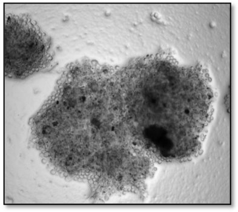

```{r setup, include=FALSE}
knitr::opts_chunk$set(
  results = 'asis',
  echo = FALSE,
  warning = FALSE,
  message = FALSE,
  fig.align = 'center'
)

#Load libraries
library(tidyverse)
library(gapminder)
library(kableExtra)
```


# Introduction

My name is Natalia Malinowski and I am a PhD student at CSIRO in conjunction with the University of Western Australia. Prior to starting my PhD journey, I had achieved a Bachlor of Biomedical Science and a Master of Infectious Disease. I coach Synchronised Swimming and do Polish Folkloric Dance in my spare time on top of holding down a couple of part time jobs. Data School has taught me so many skills that I have been able to carry across to my PhD work. I am now able to code, and finally understand some statistics! 

# My Project

Climate change is a hot topic worldwide with Australia witnessing first hand the catastrophic effects that climate change has on us and our environment. Australia's drying climate is forcing water utilities to look into alternative ways to store and distribute water. This means that the burden on drinking water storage tanks (DWSTs) is increasing. Free-Living Amoebae (FLA) and their associated amoebae resistance bacteria (ARB) can cause severe and debilitating diseases in humans. *Naegleria fowleri* is the causative agent of primary amoebic meningoencephalitis (PAM) which has a worlwide mortality rate of 97%. In Western Australia water utilites has not assessed the presence and abundance of FLA and ARBs in our DWSTs and this study aims to address this. 


## Preliminary results

The table and figures below show the results I collected from nine of the WA metropolitan DWSTs. This is just an example of what I have managed to accomplish in R thus far.  


**Tables**
```{r mytable, out.width='100%', echo = F}

tanks_data <- read.csv("resources/data/watercorp_qpcr_tidied_data_rmd.csv") %>% 
  view()

knitr::kable(head(tanks_data, n = 55), format = "html", caption = "qPCR detections of FLA and ARB in a WA metropolitan DWST") %>% 
  kable_styling("striped") %>% 
  kableExtra::scroll_box(width = "100%", height = "300px")
```

&nbsp;


**Image of N.fowleri on NNA**

<center>
{width=400px}

</center>
  

**Plots from R**
```{r standard-plot, out.width='60%', fig.align='center', fig.height= 4, fig.width=6, fig.cap="Yet another gapminder plot"}
gapminder %>% 
  filter(year == 1987) %>% 
  ggplot(aes(x = gdpPercap, y = lifeExp, colour = continent, size = pop)) +
  geom_point() +
  scale_x_log10(labels = function(b) format(b, scientific = F)) +
  scale_size(trans = "sqrt", guide = "none") +
  scale_color_brewer(palette = "Set1") +
  theme_linedraw() +
  theme(legend.position = "bottom")

```


# My Digital Toolbox

Here is a list of tools that I have been using since I started Data School FOCUS. I have found the online cheatsheets  as well as forums really helpful when troubleshooting. 


* tidyverrse
* read.xl
* R - dplyr
* ggplot


{.pull-right width=100px}


# My time went ...

The 10 weeks flew by! 
Initially I was skeptical about needing to tidy my data in 'R'. Tidying my data in excel would only take me a couple of hours whereas tidying in 'R' was going to take me a really long time. However, I stuck with the process and was so surprised by my ability to troubleshoot and figure things out on my own! This was the most challenging but also, most rewarding part of Data Schoo FOCUS for me! 


# Next steps

As I have only just finished collecting my data for my PhD project, I am excited to use the skills learned during the visualisation and statistics sessions to start analysing my data. 


# My Data School Experience

My experience has been one of great relief. Relief, that I have finally come out of a course and understood everything that I was meant to understand! From data management; visualisation; statistics to presentations, I have gained many skills and knowledge that I have already been able to apply to my everyday work. I have applied data management measures to ensure that all of my files and folders are correctly labelled with a clear filing system, I have managed to tidy and combine my datasets in ‘R’ and am in the process of starting my visualisation and analysis. 
I feel like the possibilities are endless, thank you so much for this opportunity!

